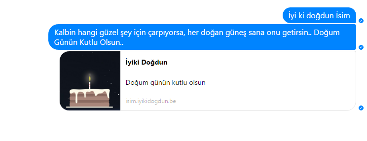

fb-iyikidogdun.be
==================



İyi ki doğdun mesajları atmaktan mı bıktınız? işte bu tam size göre belirttiğiniz sürede giriş yapıp, doğum günü gelen arkadaşlarınıza mesaj atar.

düğmesi nerde bunun
-------------------

Çalıştırmadan önce `config` klasörü içindeki `default.json` dosyasını açın, ve facebook bilgilerinizi girin. Endişe etmenize gerek yok bilgileriniz sizin ile kalacaktır. facebook-chat-api açık kaynaktır kodları kontrol edebilirsiniz.

```json
{
  "email": "fb kullanıcı adım",
  "password": "şifrem",
  "schedule": "0 */6 * * *",
  "message": "İyi ki doğdun {fullName}__nextmessage__{randomMessage}__nextmessage__[url]{url}[/url]",
  "randomMessages": [
    "Yeni yaşın önce sağlık ve huzur sonra dilediğin tüm mutlulukları getirsin sana nice yıllara…",
    "Hayatının her döneminde mutlu ve sağlıklı olmanı diliyorum. Tüm hayallerin gerçekleşsin, hayat güneşin her daim seni aydınlatsın. Doğum günün kutlu olsun..",
    "Kalbin hangi güzel şey için çarpıyorsa, her doğan güneş sana onu getirsin.. Doğum Günün Kutlu Olsun..",
    "Yılların sormadığı, yolların yormadığı, dostların unutmadığı bir ömür için, bu doğum günün bir başlangıç olsun, yeni yaşın Kutlu olsun.. İyi ki doğdun",
    "Bugün geride kalan bir yaşını daha doldurmanın mutluluğunu yaşarken geleceğin sana kalbindeki tüm dilekleri vermesini diliyorum. Doğum günün kutlu olsun.",
    "Güzel bir yaş diliyorum sana. Mutlu bir gelecek. Gülümseyen gözlerinle… İyi ki doğdun. Doğum günün kutlu olsun."
  ]
}
```

`message` kısmını istediğiniz gibi düzenleyebilirsiniz. Format tipi `ezFormat`'tır. Format sırasında aşağıdaki bilgileri kullanabilirsiniz.

```js
{
     "firstName": "", // kişinin adı
     "gender": "", // cinsiyeeti
     "userID": "", // kullanıcı id'si
     "fullName": "", // kişinin tam adı
     "profilePicture": "", // profil resmi urli
     "profileUrl": "", // profil urli
     "vanity": "", // hesabın facebook url'i
     "isBirthday": true,
     "url": "", // üretilen iyikidogdun.be linki örn: http://xxxx.iyikidogdun.be
     "randomMessage": "" // rastgele seçilen mesaj
}
```

> **Not:** Verileri (örneğin fullName) başına `{` sonuna `}` koyacak şekilde yazarsanız (örneğin `{fullName}`) sistem otomatik olarak bu yazı yerine istediğiniz veriyi koyacaktır.


> **Not:** `[url]` ve `[/url]` eğer bir mesaj bu taglar arasında yazıldıysa facebook'a link mesajı şeklinde iletişecektir.
> Lütfen bu mesajlara url dışında bir şey yazmayın. Muhtemelen hatalı olacaktır.

> **Not:** Çoklu mesaj için `__nextmessage__` kullanın. Her yazdığınız `__nextmessage__` bir mesajı sonlandırıp diğer mesaja başlangıç yapacaktır. Default olarak gelen ayarlarda 3 tane ayrı doğum günü mesajı atmaktadır.

schedule kısmı sıklığı belirtir. Default ayarlarda her 6 saatte bir giriş yapıp kontrol edecektir. Dilerseniz bu ayarı değiştirebilirsiniz.

Config işini hallettikten sonra üst dizine çıkıp önce `npm i` daha sonrada `node src/app.js` ya da `npm start` yada `node .` kodunu çalıştırın. Bu sayede sistemi `on`'a getirmiş oluyoruz. gg ez


